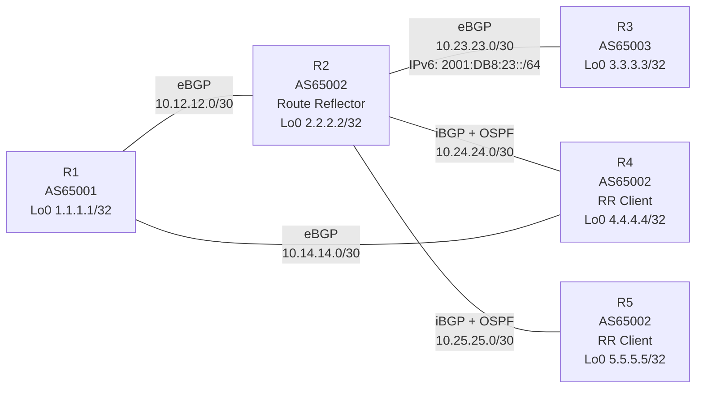

# CCNP Enterprise BGP CML Lab

A hands-on Cisco Modeling Labs (CML) project built to practice and troubleshoot BGP at CCNP Enterprise level, with several topics extending into advanced/CCIE-style behavior.

The lab evolved incrementally from basic eBGP into a multi-router design with iBGP, route reflection, path manipulation, communities, aggregation, conditional advertisements, session protection, BFD, and MP-BGP IPv6.

> **Platform:** Cisco CML / IOSv  
> **BGP ASNs:** 65001, 65002, 65003  
> **IGP inside AS65002:** OSPF process 10, area 0

---

## Topology



### Physical / Transit Addressing

| Link | R1/R2/R3/R4/R5 Addresses | Purpose |
|---|---|---|
| R1 ↔ R2 | 10.12.12.1/30 ↔ 10.12.12.2/30 | eBGP AS65001 ↔ AS65002 |
| R2 ↔ R3 | 10.23.23.1/30 ↔ 10.23.23.2/30 | eBGP AS65002 ↔ AS65003 |
| R2 ↔ R4 | 10.24.24.1/30 ↔ 10.24.24.2/30 | AS65002 internal underlay |
| R2 ↔ R5 | 10.25.25.1/30 ↔ 10.25.25.2/30 | AS65002 internal underlay |
| R1 ↔ R4 | 10.14.14.1/30 ↔ 10.14.14.2/30 | Second eBGP path into AS65002 |
| R2 ↔ R3 IPv6 | 2001:DB8:23::1/64 ↔ 2001:DB8:23::2/64 | MP-BGP IPv6 |

### Infrastructure Loopbacks

| Router | Loopback0 | ASN | Role |
|---|---:|---:|---|
| R1 | 1.1.1.1/32 | 65001 | External BGP router |
| R2 | 2.2.2.2/32 | 65002 | Route Reflector |
| R3 | 3.3.3.3/32 | 65003 | External BGP router |
| R4 | 4.4.4.4/32 | 65002 | RR client / border router |
| R5 | 5.5.5.5/32 | 65002 | RR client |

---

## BGP Architecture

AS65002 uses loopback-based iBGP sessions and OSPF as the underlay.

R2 is configured as the Route Reflector with an explicit cluster ID. R4 and R5 are RR clients.

Key design points:

- Explicit BGP router IDs.
- `no bgp default ipv4-unicast` with explicit AF activation.
- R2 uses a peer-group named `RR-CLIENTS`.
- R4/R5 static neighbors are activated individually under the IPv4 address family on the IOSv image used in this lab.
- OSPF provides reachability to internal BGP loopback next hops.
- eBGP exists toward R1 and R3.

Example R2 design:

```cisco
router bgp 65002
 bgp router-id 2.2.2.2
 bgp cluster-id 2.2.2.2
 no bgp default ipv4-unicast
 neighbor RR-CLIENTS peer-group
 neighbor RR-CLIENTS remote-as 65002
 neighbor RR-CLIENTS update-source Loopback0
 neighbor 4.4.4.4 peer-group RR-CLIENTS
 neighbor 5.5.5.5 peer-group RR-CLIENTS
```

---

## Topics Practiced

### 1. eBGP Fundamentals

Built eBGP adjacencies between:

- R1 AS65001 ↔ R2 AS65002
- R2 AS65002 ↔ R3 AS65003
- R1 AS65001 ↔ R4 AS65002

Practiced:

- BGP FSM states
- TCP port 179
- eBGP TTL behavior
- keepalive / hold timers
- exact RIB match required by the BGP `network` statement
- AS_PATH loop prevention
- administrative distance
- BGP RIB vs global RIB vs CEF

### 2. iBGP and Route Reflection

Built loopback-based iBGP inside AS65002.

Practiced:

- `update-source Loopback0`
- OSPF underlay reachability
- iBGP split-horizon behavior
- full-mesh scaling problem
- Route Reflector
- RR clients
- `ORIGINATOR_ID`
- `CLUSTER_LIST`
- next-hop preservation during route reflection
- `next-hop-self`

### 3. BGP Best-Path Manipulation

Hands-on experiments included:

#### Weight

Used Cisco Weight to influence local best-path selection.

#### Local Preference

Used Local Preference to prefer an AS65002 exit and verified propagation through iBGP.

#### AS_PATH Prepending

Configured the prefix-list:

```cisco
ip prefix-list PREPEND-PREFIX seq 10 permit 22.22.22.22/32
```

and route-map:

```cisco
route-map PREPEND-TO-R1 permit 10
 match ip address prefix-list PREPEND-PREFIX
 set as-path prepend 65002 65002 65002
```

#### MED

Used `11.11.11.11/32` to compare different MED values advertised toward AS65002.

#### ORIGIN

Used `12.12.12.12/32` to compare IGP origin (`i`) against incomplete (`?`).

#### eBGP vs iBGP

Compared otherwise eligible paths and observed the eBGP preference step in the BGP decision process.

#### IGP Metric to BGP Next Hop

Changed underlying OSPF metrics and observed BGP best-path changes without changing BGP attributes.

---

## Prefix Filtering and Route Maps

Inbound and outbound filtering was implemented between R2 and R3.

Examples include:

```cisco
ip prefix-list R3-IN seq 5 permit 3.3.3.3/32
ip prefix-list R3-IN seq 10 permit 30.30.32.0/22 ge 24 le 25
ip prefix-list R3-IN seq 50 permit 40.40.0.0/22 le 24
ip prefix-list R3-IN seq 60 permit 50.50.0.0/23 le 24
ip prefix-list R3-IN seq 70 permit 172.16.70.0/24
```

The inbound route-map `R3-POLICY-IN` was used to combine filtering and attribute manipulation.

Key lessons:

- Prefix-list `permit` means "match this prefix" when referenced by a route-map.
- The route-map `permit` / `deny` determines the policy action.
- Route-map sequence order matters.
- The first matching sequence wins.
- `0.0.0.0/0` matches only the default route.
- `0.0.0.0/0 le 32` matches all IPv4 prefixes.

---

## BGP Communities

Standard and well-known communities were tested.

Custom communities:

- `65003:100`
- `65003:200`
- `65002:300`

Community-based Local Preference was implemented on R2.

Well-known communities tested:

- `no-export`
- `no-advertise`

Example R3 policy:

```cisco
route-map SET-COMMUNITY-TO-R2 permit 10
 match ip address prefix-list COMMUNITY-PREFIX
 set community 65003:100

route-map SET-COMMUNITY-TO-R2 permit 20
 match ip address prefix-list NO-EXPORT-PREFIX
 set community no-export

route-map SET-COMMUNITY-TO-R2 permit 30
 match ip address prefix-list NO-ADVERTISE-PREFIX
 set community no-advertise

route-map SET-COMMUNITY-TO-R2 permit 40
 match ip address prefix-list ADDITIVE-PREFIX
 set community 65003:100 65003:200
```

Also practiced:

- `additive`
- deleting selected communities with a community-list
- using communities as policy signals between autonomous systems

---

## BGP Aggregation

Aggregation exercises used the `40.40.0.0/22` and `50.50.0.0/23` ranges.

Practiced:

- `aggregate-address`
- aggregate + component routes
- `summary-only`
- Null0 aggregate/discard behavior
- longest-prefix match
- `as-set`
- AS_SET loop prevention
- `suppress-map`
- `unsuppress-map`

Example:

```cisco
aggregate-address 40.40.0.0 255.255.252.0 suppress-map SUPPRESS-SPECIFIC
```

The `40.40.2.0/24` component was selectively suppressed and then selectively unsuppressed toward a specific neighbor.

---

## Conditional BGP Advertisement

A documentation prefix was used as an upstream health indicator:

```text
203.0.113.0/24
```

### Conditional Default Origination

R2 advertises a default route toward R3 only while the tracking condition is satisfied.

```cisco
neighbor 10.23.23.2 default-originate route-map CONDITIONAL-DEFAULT
```

### `advertise-map` / `exist-map`

Tested advertising a service prefix only while an upstream route exists.

### `advertise-map` / `non-exist-map`

The backup service prefix:

```text
172.16.60.0/24
```

is advertised when the upstream tracking prefix is absent.

This demonstrated policy-driven failover without taking down the BGP adjacency.

---

## BGP Session Security and Protection

### TCP MD5 Authentication

Configured BGP neighbor authentication on the R2-R3 IPv4 session.

The lab demonstrated that changing authentication did not necessarily destroy an already established TCP session immediately, while a hard reset forced a new TCP/179 session and exposed an authentication mismatch.

### TTL Security / GTSM

Configured:

```cisco
neighbor 10.23.23.2 ttl-security hops 1
```

and the corresponding configuration on R3.

### Maximum Prefix Protection

Final R2 protection:

```cisco
neighbor 10.23.23.2 maximum-prefix 30 80
```

Tested lowering the limit below the number of received routes.

Observed behavior:

- threshold warning
- maximum exceeded
- entire BGP session terminated
- all routes from the peer removed
- BFD showing `AdminDown` as a consequence of the BGP administrative shutdown

---

## Fast Failure Detection with BFD

BFD was enabled on the R2-R3 link.

Example:

```cisco
bfd interval 300 min_rx 300 multiplier 3
```

BGP was bound to BFD with:

```cisco
neighbor 10.23.23.2 fall-over bfd
```

This demonstrated why BFD can detect silent failures significantly faster than normal BGP hold timers.

BGP timers were also changed to:

```cisco
neighbor 10.23.23.2 timers 10 30
```

---

## MP-BGP IPv6

IPv6 was added alongside the existing IPv4 BGP design.

Transit network:

```text
2001:DB8:23::/64
```

Service prefixes:

```text
R2: 2001:DB8:2:50::/64
R3: 2001:DB8:3:50::/64
```

The lab demonstrated the separation between neighbor definition and AFI/SAFI activation:

```cisco
neighbor 2001:DB8:23::2 remote-as 65003

address-family ipv6
 neighbor 2001:DB8:23::2 activate
```

Verification included:

```cisco
show bgp ipv6 unicast summary
show bgp ipv6 unicast
show ipv6 route
```

---

## Troubleshooting Exercises

The topology was intentionally broken multiple times to practice a structured workflow:

1. **Root Cause**
2. **Verification Commands**
3. **Remediation**

Faults tested included:

- wrong remote AS
- TCP/179 blocked while ICMP still worked
- missing IPv6 AF activation
- BGP MD5 mismatch
- TTL-security mismatch
- next-hop resolution failure
- inbound policy filtering
- maximum-prefix shutdown
- BFD state interpretation
- route present in BGP but invalid
- BGP Established but prefix missing

A key troubleshooting rule used throughout the lab:

```text
Neighbor not Established
    → troubleshoot session / TCP / reachability / authentication / TTL

Neighbor Established but prefix missing
    → troubleshoot origination and routing policy

Prefix present but invalid
    → troubleshoot BGP NEXT_HOP reachability
```

---

## Useful Verification Commands

```cisco
show ip bgp summary
show ip bgp
show ip bgp neighbors
show ip bgp neighbors <neighbor> advertised-routes
show ip route
show ip cef
show ip ospf neighbor
show ip ospf interface brief
show bfd neighbors
show route-map
show ip prefix-list
show ip community-list
show bgp ipv6 unicast summary
show bgp ipv6 unicast
show ipv6 route
show logging
show tcp brief all
```

---

## Repository Structure

Recommended GitHub structure:

```text
ccnp-bgp-cml-labs/
├── README.md
├── topology/
│   └── BGP.yaml
├── configs/
│   ├── R1.cfg
│   ├── R2.cfg
│   ├── R3.cfg
│   ├── R4.cfg
│   └── R5.cfg
└── notes/
    └── troubleshooting.md
```

`topology/BGP.yaml` is the CML topology export and can contain the IOSv startup configurations.

The standalone `configs/` files are optional but useful for browsing configuration directly from GitHub without opening the CML YAML.

---

## Importing the Lab into Cisco CML

1. Download `topology/BGP.yaml`.
2. Import the YAML into Cisco Modeling Labs.
3. Verify that the IOSv node definition is available.
4. Start the lab.
5. Allow routing protocols to converge.
6. Verify BGP, OSPF, BFD, and MP-BGP state using the commands above.

---

## Security Note

Do not publish real credentials.

Cisco `password 7` values are **reversible obfuscation**, not secure encryption. They can be decoded easily.

For a public repository, replace BGP Type 7 passwords and any device credentials with placeholders, for example:

```cisco
neighbor 10.23.23.2 password <REDACTED>
```

Cisco Type 9 `secret` values are one-way password hashes and are substantially stronger than Type 7, but lab login hashes still do not need to be present in a public repository.

For public GitHub repositories, the safest approach is to sanitize:

- BGP neighbor passwords
- local usernames/secrets
- enable secrets
- SNMP communities
- API tokens / keys
- any real production addressing or organization-specific data

---

## Purpose

This repository is a learning project focused on understanding **why BGP behaves the way it does**, not only memorizing configuration commands.

The goal was to repeatedly:

- build a feature
- verify control-plane state
- inspect RIB/FIB behavior
- intentionally break the feature
- diagnose the failure
- restore the network

The lab is intended for CCNP Enterprise BGP study and advanced routing practice.
