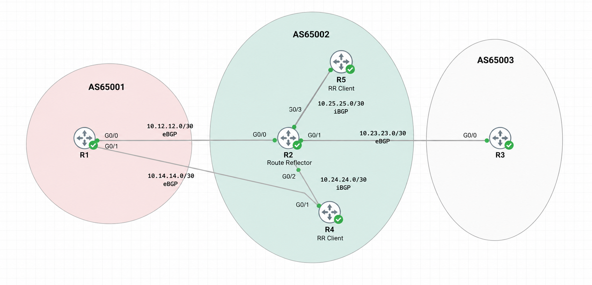

# CCNP BGP CML Lab

This repository contains my BGP practice lab built in Cisco Modeling Labs (CML).

I used one topology and expanded it step by step while studying BGP for CCNP Enterprise. The goal was not only to configure BGP, but also to understand the routing decisions, verify the results, and troubleshoot problems when something was intentionally broken.

## Topology
```mermaid
...
flowchart LR
    R1["R1<br/>AS65001<br/>Lo0 1.1.1.1/32"]
    R2["R2<br/>AS65002<br/>Route Reflector<br/>Lo0 2.2.2.2/32"]
    R3["R3<br/>AS65003<br/>Lo0 3.3.3.3/32"]
    R4["R4<br/>AS65002<br/>RR Client<br/>Lo0 4.4.4.4/32"]
    R5["R5<br/>AS65002<br/>RR Client<br/>Lo0 5.5.5.5/32"]

    R1 ---|"eBGP<br/>10.12.12.0/30"| R2
    R2 ---|"eBGP<br/>10.23.23.0/30<br/>IPv6: 2001:DB8:23::/64"| R3
    R2 ---|"iBGP + OSPF<br/>10.24.24.0/30"| R4
    R2 ---|"iBGP + OSPF<br/>10.25.25.0/30"| R5
    R1 ---|"eBGP<br/>10.14.14.0/30"| R4
```
## Lab Topology



### Logical Topology

### Main Links

| Link | Network | Purpose |
|---|---|---|
| R1 ↔ R2 | 10.12.12.0/30 | eBGP AS65001 ↔ AS65002 |
| R2 ↔ R3 | 10.23.23.0/30 | eBGP AS65002 ↔ AS65003 |
| R2 ↔ R4 | 10.24.24.0/30 | iBGP / OSPF underlay |
| R2 ↔ R5 | 10.25.25.0/30 | iBGP / OSPF underlay |
| R1 ↔ R4 | 10.14.14.0/30 | Second eBGP path into AS65002 |
| R2 ↔ R3 IPv6 | 2001:DB8:23::/64 | MP-BGP IPv6 |

### Loopback0 Addresses

| Router | Loopback0 | ASN | Role |
|---|---|---|---|
| R1 | 1.1.1.1/32 | 65001 | External BGP router |
| R2 | 2.2.2.2/32 | 65002 | Route Reflector |
| R3 | 3.3.3.3/32 | 65003 | External BGP router |
| R4 | 4.4.4.4/32 | 65002 | RR client |
| R5 | 5.5.5.5/32 | 65002 | RR client |

Inside AS65002, OSPF is used as the underlay so the BGP loopbacks are reachable.

## What I Practiced

The lab covers:

- eBGP and iBGP
- loopback-based iBGP peering
- Route Reflector and RR clients
- BGP next-hop behavior
- Weight
- Local Preference
- AS_PATH prepending
- MED
- ORIGIN
- eBGP vs iBGP best-path selection
- IGP metric to the BGP next hop
- iBGP multipath
- prefix-lists
- route-maps
- BGP communities
- `no-export` and `no-advertise`
- community `additive`
- BGP aggregation
- `summary-only`
- `as-set`
- `suppress-map`
- `unsuppress-map`
- conditional default origination
- `advertise-map`
- `exist-map`
- `non-exist-map`
- peer-groups
- BGP MD5 authentication
- TTL security
- `maximum-prefix`
- BFD
- BGP timers
- MP-BGP for IPv6
- BGP troubleshooting

## Conditional Advertisement

One of the later exercises uses:

```text
203.0.113.0/24
```

as an upstream tracking prefix.

When the tracking prefix is present:

```text
0.0.0.0/0       -> advertised to R3
172.16.50.0/24   -> advertised normally
172.16.60.0/24   -> not advertised
```

When the tracking prefix disappears:

```text
0.0.0.0/0       -> withdrawn
172.16.50.0/24   -> remains advertised
172.16.60.0/24   -> advertised as the backup prefix
```

This was used to practice conditional BGP policy without taking down the BGP session.

## IPv6

The R2-R3 link was also configured for MP-BGP IPv6.

Transit network:

```text
2001:DB8:23::/64
```

Service prefixes:

```text
R2: 2001:DB8:2:50::/64
R3: 2001:DB8:3:50::/64
```

This helped demonstrate that defining a BGP neighbor with `remote-as` is not enough by itself. The neighbor also needs to be activated under the correct address family.

## Troubleshooting

I intentionally broke different parts of the lab and used verification commands to find the root cause.

Examples included:

- wrong remote AS
- TCP/179 blocked while ping still worked
- missing IPv6 address-family activation
- MD5 password mismatch
- next-hop reachability failure
- inbound filtering
- maximum-prefix shutdown
- BFD state changes

The troubleshooting approach used throughout the lab was:

1. Find the root cause.
2. Verify it with `show` commands.
3. Apply the minimum configuration needed to fix it.
4. Verify the final routing state.

## Useful Verification Commands

```cisco
show ip bgp summary
show ip bgp
show ip bgp neighbors
show ip route
show ip cef
show ip ospf neighbor
show bfd neighbors
show ip prefix-list
show route-map
show bgp ipv6 unicast summary
show bgp ipv6 unicast
show ipv6 route
show logging
```

## CML Topology

The CML YAML file is included in this repository and can be imported directly into Cisco Modeling Labs.

After importing the lab:

1. Start all routers.
2. Allow OSPF and BGP to converge.
3. Verify the routing state with the commands above.

## Note

This is a personal learning lab. The addressing and credentials are used only for the CML environment and are not related to any production network.
